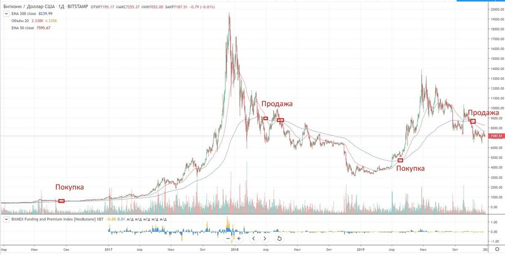

<h1>Торговая стратегия пересечения двух скользящих средних</h1>

 

простая система, которая основана на пересечении двух EMA (экспоненциальной скользящей средней или exponential moving average) — быстрой FMA и медленной SMA. <a href="https://dzen.ru/media/id/5eb5837bd86ce72cb4b19576/strategiia-peresechenie-skolziascih-srednih-5edb8542f7ccae3c3f4aaa4d">подробнее ...</a>

<h2>Особенности</h2>

- Очень простая стратегия в применении.
- Использует простые индикаторы.
- Легко обозначить уровни стоп-лосса.
- Скользящие средние тормозят — задержка может быть до 10 баров.
- Не эффективна во время боковых движений на рынке.

<h2>Условия открытия</h2>

**Длинной позиции**
- когда FMA пересекает SMA снизу.

**Короткой позици**
- когда FMA пересекает SMA сверху.

<h2>Условия выхода</h2>

- трейлинг Стоп-лосс;
- новое противоположное пересечение.

<h2>Услтановка</h2>

1. Все необходимы пакеты содержаться в файле requirements.txt после копирования проекта просто дайте согласие на установку всех необходимых зависмостей;
2. Заполните занчения API и Secret key в файле Keys.py.
3. Запустите робота в main.py 
